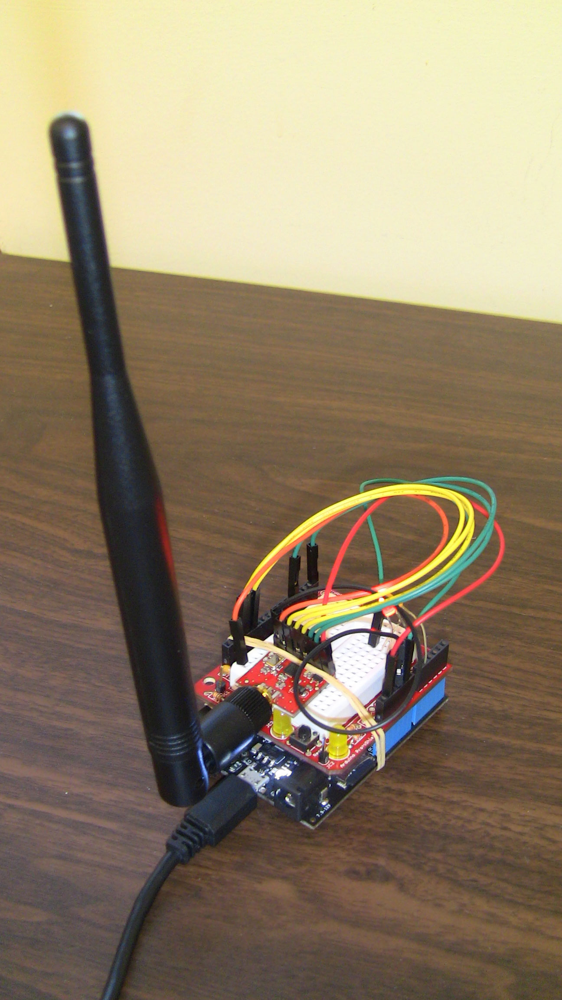

#Openbeacon Reader on the Arduino

Here is a simple rendition of an Openbeacon reader running on an Arduino. There are no frills in this implementation.  The system consists of:

* an Arduino Uno + Ethernet shield OR a [Freetronics EtherTen] (http://www.freetronics.com/products/etherten)
* a Transceiver nRF24L01+ Module with RP-SMA (WRL-00705) from [Sparkfun](https://www.sparkfun.com/products/705)
* a 2.4GHz Duck Antenna RP-SMA (WRL-00145) from [Sparkfun](https://www.sparkfun.com/products/145) (to increase the receive range)



##Operation

We are interested in using the raw output from  the readers in a number of different research projects, some simultaneously.  To this end, we take the data from the reader and deliver it to a publish/subscribe server running the MQTT protocol via an Ethernet connection. 

MQTT is a topic-based pubsub protocol.  In our lab, raw data is published to the topic:

```
/openbeacon/LIB/fastRaw/reader/<IP address>/
```

Any other messages from the reader are sent to the topic: 

```
/openbeacon/LIB/log
```
The current version of the software only reports on this log topic if a received message is NOT 16 bytes long (the size of an Openbeacon message).

##Wiring the System

Use the following details to connect the Arduino to the Sparfun breakout board (Arduino pin => Nordic pin):
```
GND == GND
3.3V == Vcc
11 == MOSI
12 == MISO
13 == SCK
10 == CSN for Ethernet (internally connected on the Freetronics board)
7 == CSN for nRF24L01+
8 == CE
       IRQ is left disconnected
```

##Ethernet
The MAC address of the Ethernet card is stored in the EEPROM on the Arduino, and in our case we pick up the IP address from DHCP.  You can change this code if you are running in a different environment. The source for these programs comes from the [Freetronics forum] (http://forum.freetronics.com/viewtopic.php?f=4&t=4869)

##nRF24L01+ Support
This is a copy of an earlier (and looks to be incompatible) version of the library code by Antti Kupila on Github [nRF24] (https://github.com/akupila/NRF24)

##MQTT Publish/Subscribe Client
The library to support this is available at [knolleary's Github site] (https://github.com/knolleary/pubsubclient).

##Contact
If you have problems building this, let me know and I'll update this area with any fixes needed.

Mark Schulz
Updated December 15 2014

